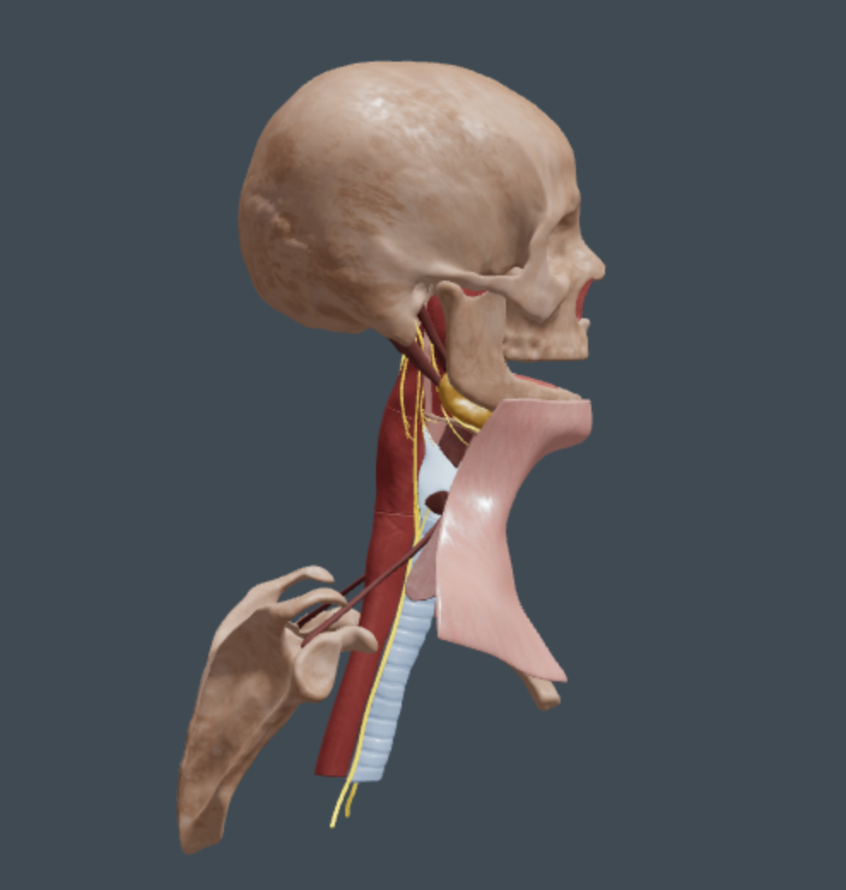

# Galen Phonation Interface



A web-based interactive interface visualizing Galen's ancient medical theories on phonation (voice production). This project combines classical anatomical knowledge with modern 3D visualization and narrative storytelling.

## Features

-   **Interactive 3D Visualizer**: A dynamic SVG-based animation of the "Pneuma" (breath) transforming into "Voice" at the larynx.
-   **Step-by-Step Narrative**: A guided tour through Galen's physiological model, from the brain *Hēgemonikon* to the *Plēgē* (strike) at the glottis.
-   **Anatomical Glossary**: Clickable medical terms providing definitions and links to the [Atlomy](https://www.atlomy.com) lexicon.
-   **Responsive Design**: A clean, "parchment" styled interface built with Tailwind CSS.

## Getting Started

### Prerequisites
You need a basic web server to run this application locally. Python 3 is recommended as it is pre-installed on most macOS systems.

### Installation & Running

1.  Open your terminal.
2.  Navigate to the project directory:
    ```bash
    cd /path/to/Phonation_interface
    ```
3.  Start a local server (Python 3):
    ```bash
    python3 -m http.server 8000
    ```
4.  Open your browser and visit:
    [http://localhost:8000/index.html](http://localhost:8000/index.html)

*Note: You must access the file via a localhost server. Opening `index.html` directly as a file (file://) will block external dependencies due to CORS policies.*

## Project Structure

-   `index.html`: The core standalone application. Contains the React application logic, 3D visualization code, and styles all in one file for portability.
-   `reference/`: Directory containing static assets (images, videos).
-   `phonation-app/`: Source code for the Vite/React version of the application (for development).
-   `user_guide.md`: A friendly guide for non-technical users explaining how to use the interface.

## Technologies

-   **React 18**: UI Component library.
-   **Three.js / React-Three-Fiber**: 3D rendering engine (utilized in component logic).
-   **Tailwind CSS**: Utility-first styling.
-   **Babel Standalone**: In-browser JSX compilation for the single-file setup.
-   **Zustand**: State management.
-   **Framer Motion**: Animations.

## Troubleshooting

### "Script Error" or Blank Page
If the page remains blank:
1.  Ensure you are running it through a local server (http://localhost:...) and not opening the file directly.
2.  Check the browser console (Cmd+Opt+J) for connection errors.
3.  This project uses `esm.sh` and `unpkg.com` for dependencies, so an active internet connection is required.

## License
[Add License Information Here]
